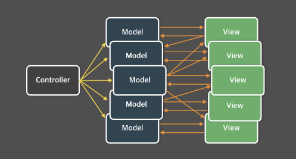

# 🟡 External Store

### 관심사의 분리

* 이미 컴포넌트를 쪼개는 것처럼 각자의 기능의 관심에 따라 나누는 것을 하고 있다.
* 한 마디로 다른 것들이 뭘 하든 내 역할만 하는 것.
* 나누는 기준은 "기능" & "구조"
* "기능" 은 입력 출력 이렇듯 그야말로 하는 일
* "구조" 는 사용자에게서 가까운 순 이렇듯 어디에서부터\~
* 각각 은 한 가지의 기능만 하는 것 좋은 것! 그래야 고치기도 쉽다
* UI & Business Logic 을 잘 나눠야 한다. => 테스트 할 때 용이 => 좋은 프로그램!!!

## Layered Architecture

* 껍데기 구조?
* 계층 구조?
* 사용자-> 서버->DB 뭐 이런식으로 \~에게 가까운 순으로 하나의 계층계층에 따라 기능 및 관심사가 다른 레이어 구조

## Flux Architecture

* MVC 의 대안
* "단방향" 데이터 플로우 구조를 말한다.
* 2way binding 구조라면 Model 과 View 의 관계가 복잡해 진다.
* MVC 패턴에서 Controller는 Model의 데이터를 조회하거나 업데이트하는 역할을 합니다. Model이 업데이트 되면, View는 화면에 반영합니다. View가 Model을 업데이트 할 수도 있습니다. Model이 업데이트 되어 View가 따라서 업데이트 되고, 업데이트 된 View가 다시 다른 Model을 업데이트 한다면, 또 다른 View가 업데이트 될 수 있습니다.
* 이러면 무거워 지고 그야말로 복잡해 지니까 문제를 찾기도 힘들고 한마디로 복잡하다. 유지보수 힘들다

<figure><figcaption></figcaption></figure>

* 단방향은 항상 Dispatch -> store -> View // View는 Action을 통해 Dispatch로\~
* Dispatcher는 Flux의 모든 데이터 흐름을 관리하는 허브 역할을 하는 부분

<figure><figcaption></figcaption></figure>

1. Action -> 이벤트/메시지 같은 객체.
2. Dispatcher -> 적절한 여러  개의 Store로 Action을 전달.
3. Store(여러 개) -> 받은 Action에 따라 상태를 변경.
4. View -> 구독하고 있는 store를 반영

## Redux

<figure><figcaption></figcaption></figure>

* Redux 의 핵심은 store가 하나!
* Redux 는 Reducer를 통해서 새로운 객체로 스테이트를 변경한다.!!!!(기존에 있는것을 바꾸는 것이 아니라, 새로운 객체를 만드는 것이다!!)
* INPUT = Action + Dispatcher
* PROCESS = Reducer
* OUTPUT = View

## External Store

* 원래 상태를 useState로 표현을 했는데, 이것을 밖으로 빼보자!
* 상태를 바꾸면 랜더링이 되어야 하는데,&#x20;
